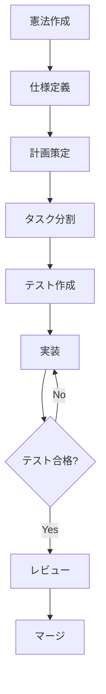

<!--
Sync Impact Report
==================
Version Change: N/A → 1.0.0 (Initial version)
Ratification Date: 2025-11-29
Amendment Basis: Initial constitution creation for FinSight project

Modified Principles: N/A (Initial creation)
Added Sections:
  - Core Principles (5 principles defined)
  - セキュリティとデータ保護
  - パフォーマンスと品質基準
  - ガバナンス

Templates Status:
  - .specify/templates/plan-template.md: ✅ aligned
  - .specify/templates/spec-template.md: ✅ aligned
  - .specify/templates/tasks-template.md: ✅ aligned
  - .github/prompts/*.md: ✅ reviewed

Follow-up Actions:
  - None pending (Initial version complete)
-->

# FinSight プロジェクト憲法

## 中核原則（Core Principles）

### I. テスト駆動開発の徹底

**原則宣言：**
すべての機能実装は、テストコードの作成、ユーザー承認、テスト失敗確認を経てから実装を開始しなければならない。仕様に対する検証は必須であり、実装なきテストは認めない。

**非交渉性：**
- テストファースト（Red-Green-Refactor）サイクルを厳格に遵守すること
- ユーザーストーリー/要件ごとに対応する自動テストが存在すること
- テストが通過しない限り、機能は「完成」とみなされない
- カバレッジ目標：ユニットテスト80%以上、統合テスト主要フロー100%

**根拠：**
金融データを扱う本プロジェクトでは、計算ロジックの正確性とデータ整合性が最重要である。テスト駆動開発により、リグレッションを防止し、仕様変更時の影響範囲を早期に検知できる。また、EDINETやAlpha Vantage APIからの外部データ取得において、予期しないフォーマット変更に対する耐性を確保する。

### II. セキュリティ要件の最優先

**原則宣言：**
セキュリティ要件は機能要件より優先される。機密データの平文保存は禁止し、暗号化またはハッシュ化を必須とする。すべてのAPIキーと機密情報はGitHub Secretsで管理し、コードリポジトリに含めてはならない。

**非交渉性：**
- APIキー、認証トークン、パスワードのハードコーディング禁止
- 機密データ（APIキー、個人情報）の平文保存禁止
- HTTPS通信の強制（外部API呼び出し時）
- Secretsのローテーション計画（6ヶ月ごと）
- ブランチ保護ルールによるコードレビュー必須化

**根拠：**
EDINET APIキーやAlpha Vantage APIキーの漏洩は、サービス停止やセキュリティ侵害につながる。GitHubリポジトリは公開される可能性があるため、Secrets管理の徹底が不可欠である。また、財務データという機密性の高い情報を扱うため、データ保護の厳格な基準を設ける。

### III. パフォーマンス閾値の定量化と受入基準への組み込み

**原則宣言：**
すべての主要機能とUIコンポーネントは、定量化されたパフォーマンス閾値を持ち、それが受入基準に組み込まれなければならない。測定可能でない性能要件は認めない。

**非交渉性：**
- LCP (Largest Contentful Paint) < 2.5秒
- TTI (Time to Interactive) < 2.0秒
- FID (First Input Delay) < 100ms
- CLS (Cumulative Layout Shift) < 0.1
- バンドルサイズ（gzip後）< 200KB
- 初期データロード < 500KB
- チャート描画（2000データポイント）< 500ms

**根拠：**
ユーザー体験の一貫性を保証するため、主観的な「速い」「遅い」ではなく、Web Vitalsなどの業界標準メトリクスで定量化する。特に、株価チャートやテクニカル指標の描画速度は、投資判断のタイミングに直結するため、明確な閾値設定が必要である。

### IV. データ品質とスキーマ検証の自動化

**原則宣言：**
外部APIから取得したすべてのデータは、保存前にスキーマ検証を通過しなければならない。データ形式の不整合や欠損は、自動検知され、GitHub Issueとして記録される。

**非交渉性：**
- データスキーマ定義ファイル（JSON Schema）の維持
- CI/CDパイプラインでの自動スキーマ検証
- 検証失敗時のフェイルセーフ処理（部分保存禁止）
- 異常データ検知時のIssue自動起票
- データバージョニング（schema_versionフィールド必須）

**根拠：**
EDINET APIやAlpha Vantage APIのレスポンス形式は予告なく変更される可能性がある。スキーマ検証により、データ取得ロジックの破綻を早期に検知し、誤ったデータがダッシュボードに表示されることを防ぐ。また、過去データとの互換性を保つためのバージョニングも必須とする。

### V. ドキュメントとコードの同期維持

**原則宣言：**
仕様書、実装計画、タスクリスト、実装コードは常に同期していなければならない。仕様変更時は、対応するドキュメントとテストコードも同時に更新する。ドキュメントとコードの乖離は、レビューで検知・是正される。

**非交渉性：**
- 仕様変更時の文書更新を同一PRに含めること
- README、API仕様書、データモデル定義の最新性維持
- コメントとコードの整合性チェック（レビュー項目）
- Mermaid図v11準拠のフローチャート/シーケンス図の挿入
- 英語部分の削除（テンプレートから生成後）

**根拠：**
複数のAIエージェント（speckit.plan, speckit.tasks, speckit.implement等）を活用した開発では、各フェーズでのドキュメントが次フェーズの入力となる。仕様とコードの乖離は、後続の開発工程でのエラー増加と手戻りを引き起こす。特に、EDINETの仕様変更や財務指標計算ロジックの修正時には、ドキュメント同期が品質維持の鍵となる。

---

## セキュリティとデータ保護

### 機密データ管理

**規定：**
- **平文保存の全面禁止**：APIキー、パスワード、個人情報は、暗号化またはハッシュ化されていない限り、ファイルシステムに保存してはならない。
- **GitHub Secretsの利用**：すべてのAPIキー（EDINET_API_KEY、ALPHA_VANTAGE_API_KEY）はGitHub Secretsに登録し、ワークフローから環境変数として参照する。
- **Secretsローテーション**：6ヶ月ごとにAPIキーを再発行し、GitHub Secretsを更新する。手順はREADMEに明記する。

### アクセス制御

**規定：**
- **ブランチ保護**：mainブランチへの直接pushを禁止し、Pull Requestとコードレビューを必須とする。
- **レビュアー要件**：重大な変更（API統合、計算ロジック、スキーマ変更）には、最低1名のレビュアー承認が必要。
- **Statusチェック必須**：ユニットテスト、統合テスト、スキーマ検証がすべて合格しない限り、マージを禁止する。

---

## パフォーマンスと品質基準

### Core Web Vitals

本プロジェクトは、Google Core Web Vitalsを基準としたパフォーマンス指標を満たす：

| 指標 | 目標値 | 測定方法 |
|------|--------|----------|
| LCP (Largest Contentful Paint) | < 2.5秒 | Lighthouse |
| TTI (Time to Interactive) | < 2.0秒 | Lighthouse |
| FID (First Input Delay) | < 100ms | Web Vitals |
| CLS (Cumulative Layout Shift) | < 0.1 | Lighthouse |

### バンドルサイズとデータロード

- **バンドルサイズ（gzip後）**：200KB以下（webpack-bundle-analyzerで測定）
- **初期データロード**：500KB以下（Network tabで測定）
- **チャート描画時間**：2000データポイントのローソク足チャート描画を500ms以内に完了

### アクセシビリティ

- **WCAG 2.1 AA準拠**：すべてのUIコンポーネントがWCAG 2.1 AAレベルの基準を満たす。
- **自動チェック**：CI/CDにaxe-coreを組み込み、アクセシビリティ違反を自動検出する。
- **コントラスト比**：通常テキスト4.5:1以上、大きなテキスト3:1以上。
- **キーボード操作**：すべてのインタラクティブ要素がTabキー/Enter/Spaceキーで操作可能。

---

## ガバナンス

### 開発プロセス順序

本プロジェクトは、以下の順序で開発を進める：

1. **憲法（Constitution）**：本文書。プロジェクトの基本方針と非交渉原則を定める。
2. **仕様（Specification）**：機能要件、ユーザーストーリー、受入基準を定義（spec.md）。
3. **計画（Plan）**：技術スタック、アーキテクチャ、データモデルを設計（plan.md）。
4. **タスク（Tasks）**：実装可能な単位に分割し、依存関係を明確化（tasks.md）。
5. **検証（Verification）**：テストコードの作成とテスト失敗確認。
6. **実装（Implementation）**：テストが通過するように機能を実装。
7. **レビュー（Review）**：コードレビュー、憲法準拠チェック、マージ。

### ブランチ戦略

**仕様ブランチ（mainから派生）：**
```bash
git checkout main
git checkout -b <番号>-<短い名前>
# 例: 001-market-vision-spec
```

**実装ブランチ（仕様ブランチから派生）：**
```bash
git checkout 001-market-vision-spec
git checkout -b feature/impl-<番号>-<短い名前>
# 例: feature/impl-001-candlestick-chart
```

### レビューと承認

**重大変更の定義：**
- 外部APIの統合・変更
- データモデル・スキーマの変更
- 財務指標計算ロジックの変更
- セキュリティ関連の変更
- パフォーマンス閾値の変更

**承認要件：**
- 重大変更には、最低1名のレビュアー承認が必要。
- すべてのStatusチェック（テスト、スキーマ検証、Lint）が合格していること。
- 憲法準拠チェックリストの完了（レビューテンプレートに含む）。

### 憲法の改定

**改定プロセス：**
1. **提案**：GitHub Issueで改定提案を作成（ラベル: `constitution-amendment`）。
2. **議論**：提案に対するフィードバックを収集（最低3営業日）。
3. **承認**：プロジェクトオーナーの承認。
4. **マイグレーション計画**：既存コードへの影響分析と移行手順の作成。
5. **更新**：憲法ドキュメントの更新とバージョンアップ。
6. **依存テンプレート更新**：plan-template.md、spec-template.md、tasks-template.mdの同期更新。

**バージョニング規則（Semantic Versioning）：**
- **MAJOR**：後方互換性のない原則の削除・再定義
- **MINOR**：新原則の追加、セクションの大幅拡張
- **PATCH**：明確化、文言修正、タイポ修正

---

## 開発方針

### 同時起動スクリプト

フロントエンドとバックエンド（データ更新スクリプト含む）を同時に起動するスクリプトを生成する。

**package.jsonの例：**
```json
{
  "scripts": {
    "dev": "concurrently \"npm run dev:frontend\" \"npm run dev:data\"",
    "dev:frontend": "vite",
    "dev:data": "python scripts/watch_and_update.py"
  }
}
```

### エラー修正の徹底

正常に動作するまで繰り返し検証し、エラー修正を完了しない限り、次のタスクに進まない。

### Mermaid図v11準拠

すべてのフローチャート、シーケンス図、状態遷移図はMermaid v11に準拠する。

**ベストプラクティス：**
- **gitGraph使用時の注意**：日本語コミットメッセージは非対応のため、flowchart/graph形式を使用する。
- **日本語対応**：flowchart、graph、sequenceDiagramは日本語完全対応。
- **推奨構文**：
  - ブランチ戦略: flowchart TB + subgraph
  - プロセスフロー: flowchart TD/LR
  - 時系列: sequenceDiagram
  - 状態遷移: stateDiagram-v2

**例：**


---

## 品質保証

### トークン制限と品質維持

- **全ファイル解析**：ワークスペース内の全ファイルを末尾まで解析する（済の場合スキップ）。
- **中断禁止**：トークン制限まで中断せず、すべてのタスクを実行する。
- **品質低下回避**：トークン制限を理由に簡略化や品質低下を行わない。
- **ブラッシュアップ**：トークン制限まで、生成したドキュメントを繰り返し改善する。
- **UTF-8エンコーディング**：文字化け対策として、すべてのファイルをUTF-8で保存する。
- **英語部分の削除**：テンプレートから生成したドキュメントの英語部分を確実に削除する。

---

**バージョン**: 1.0.0  
**批准日（Ratified）**: 2025-11-29  
**最終改定日（Last Amended）**: 2025-11-29
