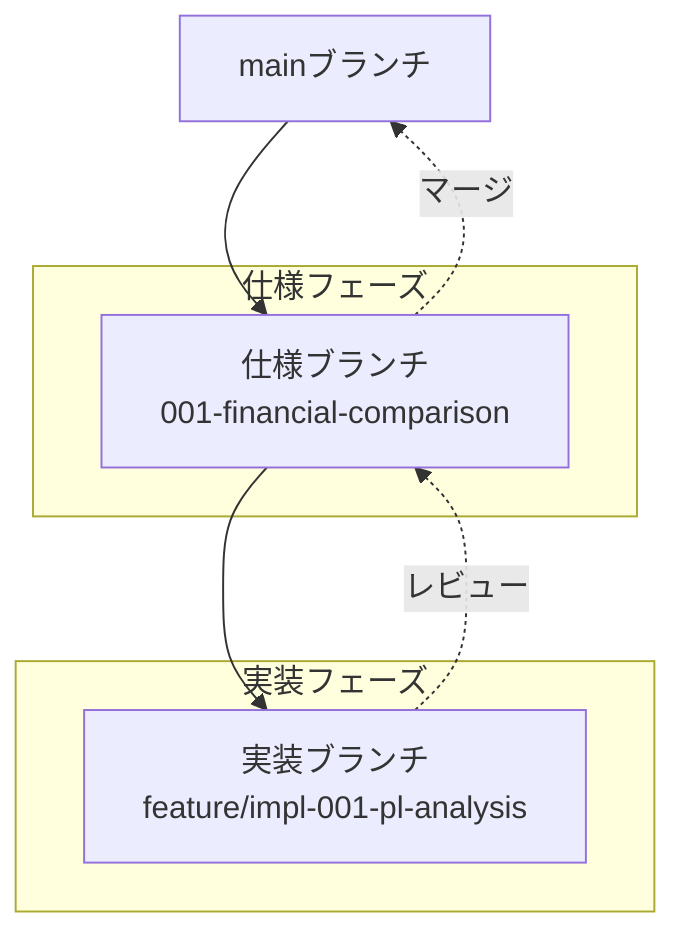
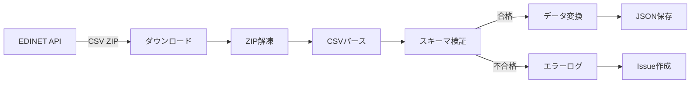
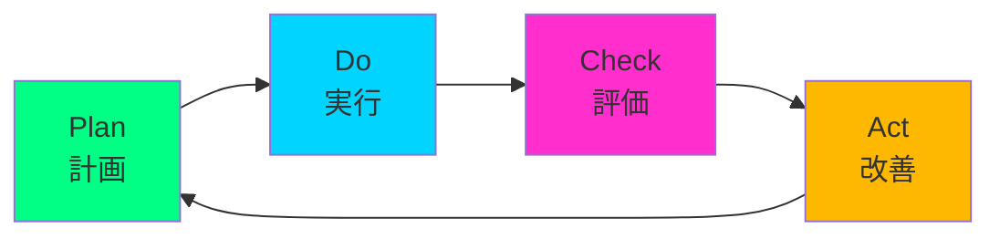

<!--
同期影響レポート:
バージョン: 1.0.0（初版）
承認日: 2025-11-29
最終改訂日: 2025-11-29

変更概要:
- 新規作成: FinSightプロジェクト憲法の初版
- 追加原則: 5つのコア原則を定義
- 追加セクション: ガバナンス、バージョニング、コンプライアンス
- テンプレート同期状況:
  ✅ plan-template.md - 憲法チェック整合性確認済
  ✅ spec-template.md - スコープ/要件整合性確認済
  ✅ tasks-template.md - タスク分類整合性確認済
  ✅ コマンドファイル - 汎用ガイダンス整合性確認済

遅延事項:
- なし（全て完了）

フォローアップTODO:
- 四半期ごとの原則レビュー実施
- プロジェクト進捗に応じた原則の適用状況モニタリング
-->

# FinSight プロジェクト憲法

**バージョン**: 1.0.0  
**承認日**: 2025-11-29  
**最終改訂日**: 2025-11-29  
**適用範囲**: FinSightプロジェクト全体（PL/BS/CF財務分析ダッシュボード）

---

## プロジェクト名称

**FinSight** — 東京電力HD・中部電力の財務諸表分析ダッシュボード

---

## ミッション宣言

FinSightは、東京電力ホールディングスおよび中部電力の財務諸表（PL/BS/CF）を構造化し、時系列比較、注記分析、リスク検知を通じて、透明性の高い財務インサイトを提供する。本プロジェクトは、データ駆動型の意思決定を支援し、財務報告の信頼性向上とステークホルダーへの説明責任を果たすことを目的とする。

---

## 第I章：基本原則

本プロジェクトは以下の5つのコア原則に基づき、全ての開発活動、意思決定、成果物の品質を評価する。

### 原則1：テスト駆動開発の徹底

**宣言**: 全ての機能実装に先立ち、テストケースを定義し、仕様に対する検証を必須とする。

**理由**: 
- 財務データの正確性は、企業価値評価と投資判断に直結する。誤ったデータや計算ミスは、重大な経営判断の誤りを招く可能性がある。
- テスト駆動開発（TDD）により、要件の明確化、コードの品質向上、回帰バグの防止が実現される。

**実装要件**:
1. **ユニットテスト**: 全ての計算ロジック（ROE、DSCR、EV/EBITDA等）に対し、境界値・異常値を含むテストケースを作成する
2. **統合テスト**: EDINET API連携、CSV/JSONパース、データ変換パイプラインの端から端までの動作を検証する
3. **E2Eテスト**: UI操作（期間切替、前年同期比較、注記表示）が正しく機能することを自動テストで確認する
4. **カバレッジ目標**: コードカバレッジ80%以上を維持する
5. **テストファースト原則**: 実装コードを書く前にテストを書き、red→green→refactorのサイクルを守る

**測定方法**:
- CIパイプラインでの自動テスト実行結果
- コードカバレッジレポート（Istanbul, pytest-cov等）
- PRレビュー時のテストコード存在確認

**違反時の対応**:
- テストが存在しないコードはmainブランチへのマージを禁止する
- カバレッジが基準を下回る場合、PRは自動的にブロックされる

---

### 原則2：セキュリティ要件の最優先

**宣言**: セキュリティ要件は機能要件より優先し、機密データの平文保存を禁止する。

**理由**:
- 財務データは企業の競争優位性と関係者のプライバシーに関わる機密情報である
- EDINET APIキー、GitHub Secrets等の認証情報の漏洩は、不正アクセスやデータ改ざんのリスクを生む
- GDPRおよび日本の個人情報保護法に準拠する必要がある

**実装要件**:
1. **認証情報管理**:
   - 全てのAPIキー、トークンはGitHub Secretsまたは環境変数で管理し、コードに直接記述しない
   - `.env`ファイルは`.gitignore`に追加し、リポジトリにコミットしない
   - Secretsのローテーションを半期に1回実施する

2. **データ暗号化**:
   - 機密性の高い財務データ（例：未公開の内部試算値）は、保存時にAES-256で暗号化する
   - 通信時はTLS 1.2以上を使用する（HTTPS必須）

3. **アクセス制御**:
   - mainブランチへの直接pushを禁止し、必ずPRレビューを経る
   - GitHub Actionsのワークフローには最小権限の原則を適用する（`permissions`を明示的に定義）

4. **依存関係の脆弱性管理**:
   - DependabotまたはRenovate Botを有効化し、脆弱性のあるパッケージを自動検知する
   - 重大度がHigh以上の脆弱性は、検知後48時間以内に対応する

**測定方法**:
- GitHub Secret Scanningの警告数（ゼロを維持）
- 依存関係の脆弱性スキャン結果（Snyk, npm audit等）
- PRレビューでのセキュリティチェックリスト確認

**違反時の対応**:
- 機密情報がコミットされた場合、直ちにGit履歴から削除し、該当Secretsをローテーションする
- セキュリティテストが失敗した場合、リリースを中止し、修正を優先する

---

### 原則3：パフォーマンス定量化と受入基準

**宣言**: パフォーマンス閾値を定量化し、全ての機能の受入基準に組み込む。

**理由**:
- 財務ダッシュボードは、迅速な意思決定を支援するツールである。ページ読み込みが遅い、グラフ描画が遅延すると、ユーザー体験が著しく損なわれる
- パフォーマンス劣化は、データ量の増加と共に発生しやすいため、継続的なモニタリングが必要である

**実装要件**:
1. **パフォーマンス予算**:
   - LCP (Largest Contentful Paint): < 2.5秒
   - TTI (Time to Interactive): < 2.0秒
   - FID (First Input Delay): < 100ms
   - CLS (Cumulative Layout Shift): < 0.1
   - バンドルサイズ（gzip後）: < 200KB
   - 初期データロード: < 500KB

2. **最適化手法**:
   - **コード分割**: React.lazy()とSuspenseで非同期ローディング
   - **画像最適化**: WebP形式、適切な解像度とファイルサイズ
   - **チャートライブラリ**: 大量データポイント（2000以上）はWebWorkerで処理
   - **キャッシング**: Service Workerによる静的アセットのキャッシュ

3. **測定とモニタリング**:
   - Lighthouseを毎ビルドで自動実行し、スコア90以上を維持
   - Real User Monitoring（RUM）でCore Web Vitalsを継続的に収集（オプション）

**測定方法**:
- CI/CDパイプラインでのLighthouse自動テスト
- webpack-bundle-analyzerによるバンドルサイズ分析
- Chrome DevToolsのPerformanceプロファイリング

**違反時の対応**:
- パフォーマンス予算を超過した場合、PRはマージ禁止となる
- 本番環境でCore Web Vitalsが劣化した場合、ホットフィックスとして優先対応する

---

### 原則4：データの再現性と監査証跡

**宣言**: 外部依存はバージョン固定により再現性を確保し、仕様と実装の乖離をレビューで検知・是正する。

**理由**:
- 財務データは、監査や規制当局への報告に使用される可能性があり、データの生成プロセスが再現可能であることが求められる
- APIやライブラリのバージョンが変わると、同じ入力でも異なる結果が生じる可能性がある
- Git履歴がそのままデータの変更ログとして機能するため、誰が・いつ・何を変更したかが明確である必要がある

**実装要件**:
1. **依存関係の固定**:
   - `package-lock.json`、`requirements.txt`（pip freeze）を必ずコミットする
   - npmパッケージは`^`や`~`を使わず、exactバージョンを指定する（例: `"react": "18.2.0"`）
   - Dockerイメージのベースイメージもタグで固定する（例: `python:3.11.5-slim`）

2. **データスキーマのバージョニング**:
   - 全てのJSON/CSVファイルに`schema_version`フィールドを含める
   - スキーマ変更時は、マイグレーションスクリプトを用意し、後方互換性を保つ
   - スキーマ仕様書（`data/schema/README.md`）を維持する

3. **仕様と実装の同期**:
   - 仕様書（spec-template.md）に記載された要件と、実装コードが一致していることをPRレビューで確認する
   - 仕様変更時は、必ず関連するコード、テスト、ドキュメントを同時更新する
   - `spec/`ブランチと`impl/`ブランチを分離し、仕様承認後に実装を開始する

**測定方法**:
- `npm ls`、`pip list`で依存関係のバージョンを確認
- スキーマバリデーションスクリプト（`scripts/validate_schema.py`）の自動実行
- PRレビューチェックリストでの仕様整合性確認

**違反時の対応**:
- バージョン未固定のパッケージが検出された場合、CIでエラーを出す
- スキーマバリデーションエラーが発生した場合、デプロイを中止する

---

### 原則5：継続的インテグレーションとデプロイメント

**宣言**: 作業順序を憲法→仕様→計画→タスク→検証→実装→レビューとし、重大変更にはレビュー承認を必須とする。

**理由**:
- 明確な作業順序により、手戻りの削減、品質の向上、チーム間の連携が円滑になる
- 仕様が確定する前に実装を始めると、後から大幅な修正が必要になり、開発効率が低下する
- レビュープロセスにより、コード品質、セキュリティ、ベストプラクティスの遵守が担保される

**実装要件**:
1. **ブランチ戦略**:
   - **仕様ブランチ**: mainから派生し、仕様策定を行う
     ```bash
     git checkout main
     git checkout -b 001-financial-statement-comparison
     ```
   - **実装ブランチ**: 仕様ブランチから派生し、機能実装を行う
     ```bash
     git checkout 001-financial-statement-comparison
     git checkout -b feature/impl-001-pl-analysis
     ```

2. **作業フロー**:
   ```
   憲法確認 → 仕様策定 → 計画作成 → タスク分解 → 
   テスト設計 → 実装 → コードレビュー → マージ → デプロイ
   ```

3. **レビュー要件**:
   - 全てのPRは最低1名のレビュワー承認が必要
   - 重大変更（APIスキーマ変更、セキュリティ関連、データモデル変更）は2名以上の承認が必要
   - レビューチェックリスト:
     - [ ] 仕様書との整合性
     - [ ] テストカバレッジ80%以上
     - [ ] セキュリティベストプラクティス遵守
     - [ ] パフォーマンス予算内
     - [ ] ドキュメント更新済み

4. **CI/CDパイプライン**:
   - **CI（継続的インテグレーション）**:
     - ユニット・統合テストの自動実行
     - Lintチェック（ESLint, Prettier, Black）
     - セキュリティスキャン（Secret Scanning, Snyk）
     - パフォーマンステスト（Lighthouse）
   - **CD（継続的デプロイメント）**:
     - mainブランチへのマージで自動的にGitHub Pagesへデプロイ
     - ステージング環境（オプション）での事前検証

**測定方法**:
- PRのマージ前チェックリスト完了率
- CI/CDパイプラインの成功率
- レビュー時間の追跡（目標: 24時間以内）

**違反時の対応**:
- レビュー未承認のコードがマージされた場合、即座にrevertし、プロセスを再実行する
- CIが失敗した場合、マージは自動的にブロックされる

---

## 第II章：ガバナンスと改訂プロセス

### 2.1 憲法の改訂手順

本憲法は、プロジェクトの成熟度に応じて進化する。改訂は以下の手順で行う。

1. **改訂提案**:
   - GitHub Issueに`constitution-amendment`ラベルを付けて提案を作成
   - 改訂理由、影響範囲、代替案を明記する

2. **議論と合意形成**:
   - プロジェクトメンバー全員による議論（最低7日間）
   - 賛成多数（2/3以上）で改訂を承認

3. **影響分析**:
   - 関連するテンプレート（plan-template.md, spec-template.md, tasks-template.md）への影響を評価
   - 既存の仕様書、計画書への遡及適用の必要性を判断

4. **同期影響レポート作成**:
   - 憲法ファイル冒頭のHTML コメントに、以下を記載:
     - 変更されたバージョン
     - 変更された原則の名称
     - 追加/削除されたセクション
     - 影響を受けるテンプレートとその更新状況
     - 遅延事項とフォローアップTODO

5. **実装と周知**:
   - 改訂版を`.specify/memory/constitution.md`にコミット
   - プロジェクトメンバーへの周知（Slack, メール等）
   - 次回プロジェクトミーティングで改訂内容を説明

### 2.2 バージョニングポリシー

憲法のバージョンは、セマンティックバージョニング（Semantic Versioning 2.0.0）に準拠する。

- **MAJOR（例: 1.0.0 → 2.0.0）**:
  - 後方互換性のない重大な変更
  - 原則の削除または根本的な再定義
  - 例: 「テスト駆動開発の徹底」原則を削除

- **MINOR（例: 1.0.0 → 1.1.0）**:
  - 後方互換性のある新機能の追加
  - 新しい原則の追加
  - 既存原則の大幅な拡張
  - 例: 「アクセシビリティ要件」原則を新規追加

- **PATCH（例: 1.0.0 → 1.0.1）**:
  - 後方互換性のある軽微な修正
  - 誤字脱字の修正
  - 説明の明確化（意味変更なし）
  - 例: 測定方法の具体例を追記

### 2.3 コンプライアンスレビュー

四半期ごとに、本憲法への準拠状況をレビューする。

**レビュー項目**:
1. 各原則の実装率（測定方法で定義した指標を集計）
2. 違反事例の数と対応状況
3. 原則の有効性評価（実際に品質向上に寄与しているか）

**レビュー結果の記録**:
- `.specify/memory/compliance_reviews/`に四半期レポートを保存
- 改善が必要な原則の特定と対策立案

---

## 第III章：開発方針と技術標準

### 3.1 フロント・バックエンド同時起動

開発効率を最大化するため、フロントエンドとバックエンド（データ更新スクリプト）を同時に起動できるコードを生成する。

**実装方法**:
- `npm run dev`: Vite開発サーバー起動（ポート5173）
- `npm run dev:data`: Pythonスクリプトのウォッチモード起動（ポート8000）
- `npm run dev:all`: concurrentlyで両方を同時起動

**package.jsonの例**:
```json
{
  "scripts": {
    "dev": "vite",
    "dev:data": "python scripts/dev_server.py",
    "dev:all": "concurrently \"npm run dev\" \"npm run dev:data\""
  },
  "devDependencies": {
    "concurrently": "^8.2.2"
  }
}
```

### 3.2 エラー修正の完全性

正常に動作するまで繰り返し検証し、エラー修正を完了する。

**検証サイクル**:
1. ユニットテスト実行 → 失敗箇所の特定
2. コード修正
3. テスト再実行 → 全て通過するまで繰り返す
4. 統合テスト → E2Eテスト → 本番デプロイ

**自動化**:
- `git pre-commit hook`でテストを自動実行
- CIパイプラインで全テストが通過しない限りマージ禁止

### 3.3 Mermaid図v11準拠のベストプラクティス

仕様書、計画書、タスクにはMermaid図を積極的に挿入し、視覚的な理解を促進する。

**Mermaid v11対応のベストプラクティス**:

1. **gitGraph使用時の注意**:
   - 日本語コミットメッセージを避けるか、flowchart/graph形式を使用
   - `tag:`構文は非推奨、代わりにノードで表現
   - `${{}}`などの特殊文字をノードラベルに使用しない

2. **日本語対応**:
   - flowchart、graph、sequenceDiagramは日本語完全対応
   - ノードラベル、エッジラベル、Noteで日本語使用可能
   - gitGraph構文は日本語コミットメッセージに対応していない

3. **推奨構文**:
   - **ブランチ戦略**: flowchart TB + subgraph
   - **プロセスフロー**: flowchart TD/LR
   - **時系列**: sequenceDiagram
   - **状態遷移**: stateDiagram-v2

**例: ブランチ戦略の可視化**:


**例: データ処理フロー**:


---

## 第IV章：品質管理と継続的改善

### 4.1 品質基準

全ての成果物（コード、ドキュメント、データ）は以下の品質基準を満たす必要がある。

1. **完全性**:
   - ワークスペース内の全ファイルを末尾まで解析し、欠落がないこと
   - トークン制限まで中断せず全てのタスクを実行すること

2. **一貫性**:
   - 英語の部分（テンプレート由来）を確実に削除し、日本語に統一すること
   - 用語集を維持し、プロジェクト内で同じ用語を使用すること

3. **可読性**:
   - UTF-8エンコーディングで文字化けを防止すること
   - コードコメント、ドキュメントは平易な日本語で記述すること
   - Markdownの見出し階層を適切に使用すること

4. **保守性**:
   - コードは自己文書化されているが、複雑なロジックには必ずコメントを付けること
   - 関数・クラスの責務を明確に分離すること

### 4.2 継続的改善のサイクル

PDCAサイクルを四半期ごとに実施する。



**Plan（計画）**:
- 四半期目標の設定（機能開発、品質改善、パフォーマンス最適化等）
- KPI（テストカバレッジ、Lighthouseスコア、デプロイ頻度等）の定義

**Do（実行）**:
- 計画に基づいた開発作業
- 日次スタンドアップでの進捗共有

**Check（評価）**:
- 四半期末のレトロスペクティブ
- KPIの実績測定と分析
- ユーザーフィードバックの収集

**Act（改善）**:
- 改善案の立案と優先順位付け
- 憲法・原則の見直し（必要に応じて改訂提案）

---

## 第V章：用語集

プロジェクト内で使用する主要用語を定義し、一貫性を保つ。

| 用語 | 定義 |
|------|------|
| **FinSight** | 本プロジェクトの名称。東京電力HD・中部電力の財務諸表分析ダッシュボード。 |
| **PL** | 損益計算書（Profit and Loss Statement）。企業の一定期間の収益と費用を示す財務諸表。 |
| **BS** | 貸借対照表（Balance Sheet）。企業の特定時点の資産、負債、純資産を示す財務諸表。 |
| **CF** | キャッシュフロー計算書（Cash Flow Statement）。企業の一定期間の現金の増減を営業・投資・財務活動ごとに示す財務諸表。 |
| **EDINET** | 金融庁が運営する電子開示システム。有価証券報告書等の法定開示書類を公開。 |
| **XBRL** | eXtensible Business Reporting Language。財務情報を電子的にタグ付けするための国際標準規格。 |
| **ROE** | 自己資本利益率（Return on Equity）。当期純利益を自己資本で除した収益性指標。 |
| **DSCR** | 元利金返済カバー率（Debt Service Coverage Ratio）。営業キャッシュフローを元利支払額で除した財務安全性指標。 |
| **EV/EBITDA** | 企業価値をEBITDA（利払前・税引前・減価償却前利益）で除した評価倍率。 |
| **TDD** | テスト駆動開発（Test-Driven Development）。テストを先に書き、そのテストを通過するコードを実装する開発手法。 |
| **CI/CD** | 継続的インテグレーション/継続的デプロイメント（Continuous Integration / Continuous Deployment）。コード変更を自動テスト・ビルド・デプロイするプロセス。 |
| **LCP** | Largest Contentful Paint。ページの主要コンテンツが描画されるまでの時間（Core Web Vitals）。 |
| **TTI** | Time to Interactive。ページが完全にインタラクティブになるまでの時間。 |
| **FID** | First Input Delay。ユーザーが最初に操作してから反応するまでの時間（Core Web Vitals）。 |
| **CLS** | Cumulative Layout Shift。ページ読み込み中のレイアウトの予期しない移動量（Core Web Vitals）。 |

---

## 第VI章：付録

### 付録A：推奨コミットメッセージフォーマット

Conventional Commitsに準拠する。

**フォーマット**:
```
<type>(<scope>): <subject>

<body>

<footer>
```

**type（必須）**:
- `feat`: 新機能
- `fix`: バグ修正
- `docs`: ドキュメント変更
- `style`: コードフォーマット（機能変更なし）
- `refactor`: リファクタリング
- `perf`: パフォーマンス改善
- `test`: テスト追加・修正
- `chore`: ビルド・設定変更

**scope（オプション）**:
- `pl`: 損益計算書機能
- `bs`: 貸借対照表機能
- `cf`: キャッシュフロー機能
- `notes`: 注記分析機能
- `edinet`: EDINET連携
- `ui`: UIコンポーネント
- `ci`: CI/CD設定

**例**:
```
feat(pl): 前年同期比較機能を追加

四半期ごとのPLデータに対し、前年同期との差異を自動計算し、
ハイライト表示する機能を実装。

Closes #42
```

### 付録B：推奨ブランチ命名規則

**仕様ブランチ**:
```
<番号>-<短い名前>

例: 001-financial-statement-comparison
```

**実装ブランチ**:
```
<type>/<番号>-<短い名前>

例: feature/impl-001-pl-analysis
    fix/impl-002-csv-parse-error
```

---

## 承認

本憲法は、FinSightプロジェクトチーム全員の合意により、2025年11月29日に承認され、即日発効する。

---

**文書履歴**:

| バージョン | 日付 | 変更概要 | 承認者 |
|-----------|------|----------|--------|
| 1.0.0 | 2025-11-29 | 初版作成 | プロジェクトチーム全員 |

---

**次回レビュー予定日**: 2026年2月28日（四半期レビュー）
