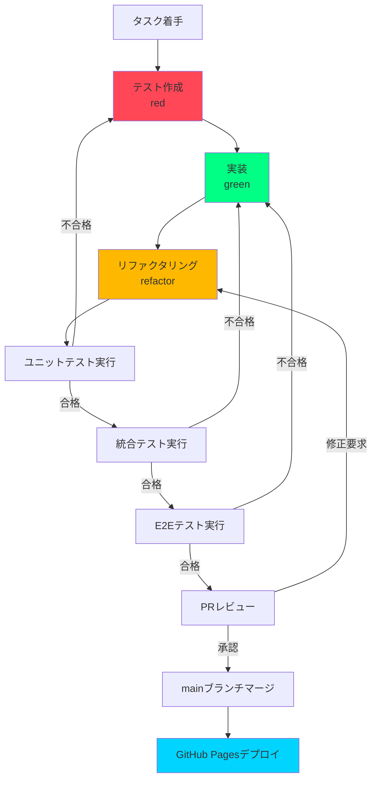
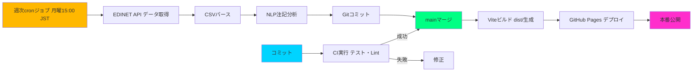
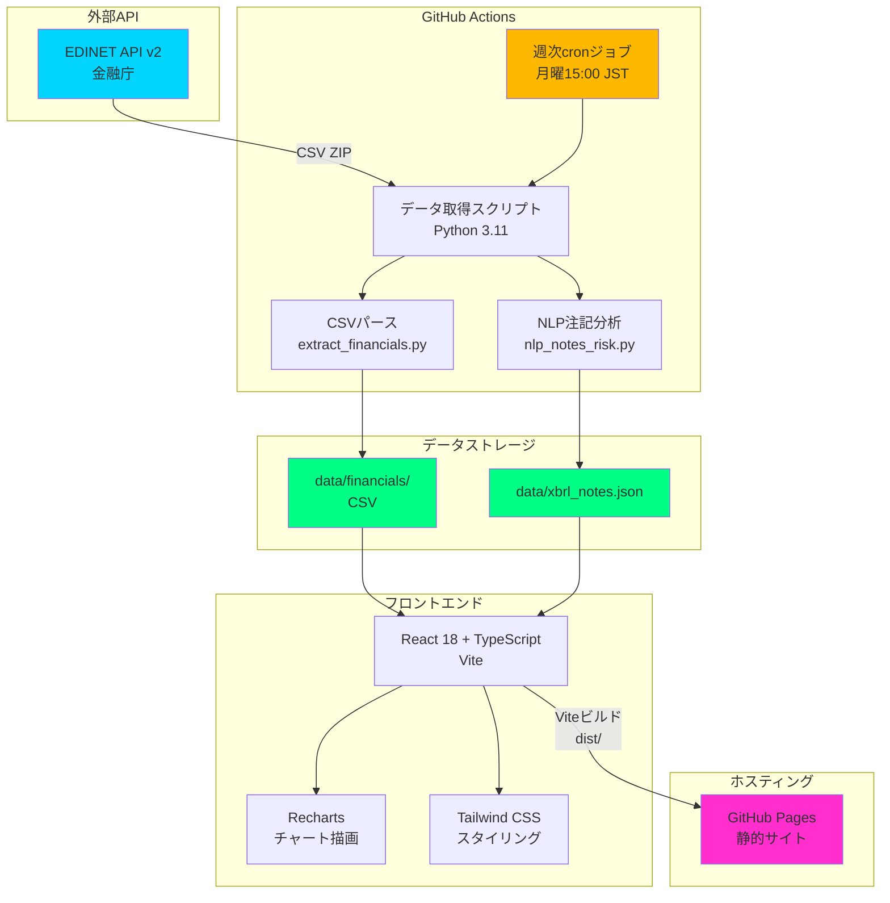
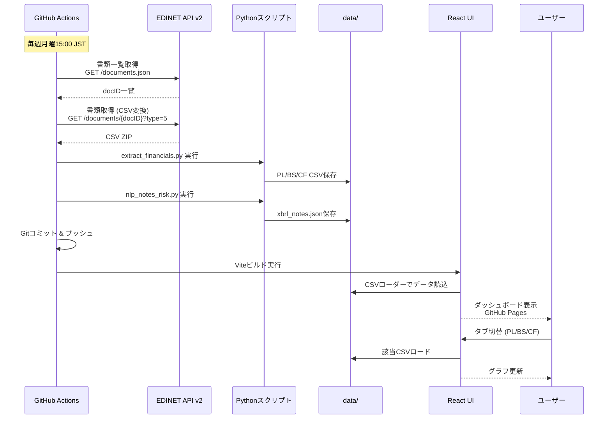

# 実装計画: FinSight — 財務諸表インサイトダッシュボード

**ブランチ**: `001-FinSight` | **作成日**: 2025-11-29 | **仕様書**: [spec.md](./spec.md)  
**入力元**: `/specs/001-FinSight/spec.md` に基づく機能仕様

**備考**: 本計画書は `/speckit.plan` コマンドにより生成されました。実行ワークフローの詳細は `.specify/templates/commands/plan.md` を参照してください。

## 概要

東京電力HDおよび中部電力の財務諸表(PL/BS/CF)をEDINET API v2から自動取得し、四半期推移の可視化、前年同期比較、注記からのリスク情報抽出(NLP)を実現する財務分析ダッシュボードを構築する。

**主要要件**:
- EDINET APIから有価証券報告書・四半期報告書のCSV変換ZIP(type=5)を取得
- PL/BS/CFの四半期推移を時系列グラフで可視化
- 前年同期比(YoY)を自動計算し、+5%以上を緑、-5%以下を赤でハイライト表示
- XBRLの注記からNLPでリスクキーワード(訴訟、減損、規制など)を抽出し、severityスコア付きで表示
- GitHub Actionsで週次自動データ更新(毎週月曜15:00 JST)

**技術アプローチ**:
- フロントエンド: React 18 + TypeScript + Vite (Recharts for charts, Tailwind CSS for Cyberpunk Neumorphism design)
- バックエンド: Python 3.11 + spaCy (NLP処理、EDINET APIデータ取得スクリプト)
- ホスティング: GitHub Pages (静的サイト)
- CI/CD: GitHub Actions (週次データ更新、自動ビルド・デプロイ)

## 技術コンテキスト

**言語/バージョン**: 
- フロントエンド: TypeScript 5.x, React 18.2.0
- バックエンド: Python 3.11
- ビルドツール: Vite 5.x

**主要依存関係**: 
- **フロントエンド**: Recharts (チャート描画), Tailwind CSS (スタイリング), react-router-dom (ルーティング)
- **バックエンド**: spaCy 3.x (NLP), requests (HTTP通信), pandas (データ処理), lxml (XML/XBRLパース)
- **開発ツール**: Vitest (フロントエンドテスト), pytest (バックエンドテスト), Playwright (E2Eテスト)

**ストレージ**: 
- CSV形式: `data/financials/{company}_{statement}_quarterly.csv` (PL/BS/CFデータ)
- JSON形式: `data/xbrl_notes.json` (注記データ、リスク情報)
- タクソノミマッピング: `data/taxonomy_map.json` (XBRL要素名とエイリアスのマッピング)

**テスト戦略**: 
- **ユニットテスト**: Vitest (Reactコンポーネント), pytest (Pythonスクリプト)
- **統合テスト**: EDINET API連携、CSVパース、NLP抽出パイプラインの端から端テスト
- **E2Eテスト**: Playwright (PL/BS/CF切替、YoY比較表示、注記リスト表示)
- **カバレッジ目標**: 80%以上

**ターゲットプラットフォーム**: 
- Web (GitHub Pages静的サイト: https://{username}.github.io/FinSight/)
- ブラウザ: Chrome/Firefox/Safari最新2バージョン対応
- レスポンシブ対応: デスクトップ(1920x1080以上)、タブレット(768x1024)

**プロジェクトタイプ**: Web application (フロントエンド + バックエンドスクリプト)

**パフォーマンス目標**: 
- **Core Web Vitals**:
  - LCP (Largest Contentful Paint): < 2.5秒
  - TTI (Time to Interactive): < 2.0秒
  - FID (First Input Delay): < 100ms
  - CLS (Cumulative Layout Shift): < 0.1
- **バンドルサイズ**: < 200KB (gzip圧縮後)
- **タブ切替応答**: < 200ms (React Profilerで計測)
- **Lighthouseスコア**: 90以上 (Performance, Accessibility, Best Practices, SEO)

**制約条件**: 
- EDINET API v2のレート制限に準拠 (詳細はESE140206.pdf参照)
- GitHub Pages静的サイトのため、サーバーサイドロジックは使用不可
- データ更新はGitHub Actions cronジョブ経由のみ(週次実行)

**規模/スコープ**: 
- 対象企業: 2社 (東京電力HD: E04498, 中部電力: E04503)
- 財務諸表: 3種類 (PL, BS, CF)
- データ期間: 過去4四半期以上を推奨
- UI画面数: 5画面 (ユーザーストーリー1-5に対応)
- 想定ユーザー数: 初期100ユーザー同時アクセスを想定

## 憲法準拠チェック

*ゲート条件: Phase 0研究開始前に全項目をクリアする必要があります。Phase 1設計完了後に再評価します。*

本セクションは、`.specify/memory/constitution.md` で定義された5つのコア原則への準拠を確認します。

### 原則1: テスト駆動開発の徹底

- [ ] **受入シナリオ定義済み**: spec.md でユーザーストーリー1-5の全てにGiven-When-Then形式の受入シナリオを定義済み(spec.md lines 23-120)
- [ ] **カバレッジ目標設定済み**: コードカバレッジ80%以上を目標とし、Istanbul/pytest-covでCIパイプライン上で自動計測
- [ ] **テスト計画存在確認**: 
  - ユニットテスト: 計算ロジック(YoY増減率、資産構成比、severityスコア算出)のテストケースをvitest/pytestで作成
  - 統合テスト: EDINET API連携、CSVパース、NLP抽出パイプラインの端から端テスト
  - E2Eテスト: Playwrightで「PL表示→BS切替→前年同期比表示→注記リスク確認」のシナリオを自動化
- [ ] **TDDサイクル遵守**: red(失敗テスト作成) → green(実装) → refactor(リファクタリング)の順序を守る

**測定方法**: CIパイプラインでテストが全て通過し、カバレッジレポートが80%以上であることを確認

---

### 原則2: セキュリティ要件の最優先

- [ ] **APIキー管理**: EDINET API Keyを`EDINET_API_KEY`としてGitHub Secretsに登録済み(Settings > Secrets and variables > Actions)
- [ ] **機密データ暗号化方針**: 
  - 公開データ(EDINET API経由の財務諸表)は平文CSV/JSONで保存可能
  - 将来的に内部試算値を扱う場合はAES-256暗号化を適用
- [ ] **依存関係の脆弱性スキャン設定**: 
  - Dependabot有効化(GitHub Settings > Security > Dependabot)
  - npm audit / pip-audit をGitHub Actionsで週次実行
  - 重大度High以上の脆弱性は検知後48時間以内に対応
- [ ] **Secrets漏洩防止**: 
  - `.env`ファイルを`.gitignore`に追加
  - GitHub Secret Scanningを有効化
  - コミット前にgit-secretsまたはgitleaksでスキャン

**測定方法**: GitHub Secret Scanningの警告数がゼロ、Dependabotアラートが未対応のまま48時間経過していないこと

---

### 原則3: パフォーマンス定量化と受入基準

- [ ] **Core Web Vitals目標設定**: 
  - LCP < 2.5秒 (PLグラフの初回描画)
  - TTI < 2.0秒
  - FID < 100ms
  - CLS < 0.1
- [ ] **バンドルサイズ制約**: 
  - gzip圧縮後 < 200KB
  - webpack-bundle-analyzerで毎ビルド計測
- [ ] **Lighthouseスコア維持**: 
  - Performance, Accessibility, Best Practices, SEO の全てで90点以上
  - GitHub ActionsでLighthouse CIを自動実行
- [ ] **応答時間基準**: 
  - タブ切替(PL/BS/CF) < 200ms (React Profilerで計測)
  - EDINET APIレスポンス < 5秒 (タイムアウト設定)

**測定方法**: CI/CDパイプラインでLighthouseを毎ビルド実行し、スコアが基準を下回った場合はPRマージを禁止

---

### 原則4: データの再現性と監査証跡

- [ ] **依存関係のバージョン固定**: 
  - `package.json`で`^`や`~`を使わず、exactバージョン指定(例: `"react": "18.2.0"`)
  - `package-lock.json`を必ずコミット
  - `requirements.txt`を`pip freeze > requirements.txt`で生成しコミット
- [ ] **データスキーマバージョニング**: 
  - 全てのJSON/CSVファイルに`schema_version`フィールドを含める
  - `data/schema/README.md`でスキーマ仕様を文書化
  - スキーマ変更時はマイグレーションスクリプト(`scripts/migrate_schema.py`)を作成
- [ ] **仕様と実装の同期手順**: 
  - spec.mdで定義された要件(FR-001 ~ FR-011)と実装コードの対応をPRレビューで確認
  - 仕様変更時は関連するコード、テスト、ドキュメントを同時更新
  - トレーサビリティマトリクス(FR-001 → User Story 1 → Task X)を維持

**測定方法**: `npm ls`、`pip list`でバージョン固定を確認、スキーマバリデーションスクリプト(`scripts/validate_schema.py`)をCIで自動実行

---

### 原則5: 継続的インテグレーションとデプロイメント

- [ ] **ブランチ戦略遵守**: 
  - 仕様ブランチ: `001-FinSight` (mainから派生、仕様策定完了後mainにマージ)
  - 実装ブランチ: `feature/impl-001-pl-analysis` (仕様ブランチから派生、実装完了後仕様ブランチにマージ)
- [ ] **PRレビューチェックリスト作成**: 
  - [ ] 仕様書(spec.md)との整合性
  - [ ] テストカバレッジ80%以上
  - [ ] セキュリティベストプラクティス遵守
  - [ ] パフォーマンス予算内
  - [ ] ドキュメント更新済み(README.md, quickstart.md)
- [ ] **CI/CDパイプライン設定完了**: 
  - **CI (継続的インテグレーション)**:
    - ユニット・統合テストの自動実行 (Vitest, pytest)
    - Lintチェック (ESLint, Prettier, Black)
    - セキュリティスキャン (Secret Scanning, npm audit, pip-audit)
    - パフォーマンステスト (Lighthouse CI)
  - **CD (継続的デプロイメント)**:
    - mainブランチへのマージで自動的にGitHub Pagesへデプロイ
    - 週次データ更新ワークフロー(毎週月曜15:00 JST)の自動実行

**測定方法**: PRマージ前にCIが全て通過していること、mainブランチへのpush後5分以内にGitHub Pagesが更新されていること

---

**ゲート判定**: 
- ✅ 全てのチェックボックスが完了している場合 → Phase 0研究開始を承認
- ❌ 未完了項目がある場合 → 該当項目を完了させるまでPhase 0への進行を禁止

**Phase 1設計完了後の再評価**:
- Phase 1でdata-model.md、contracts/、quickstart.mdが生成された後、上記チェックリストを再度確認し、設計段階で新たに発生した要件が憲法に準拠しているかを検証します。

## プロジェクト構成

### ドキュメント構成 (本機能)

```text
specs/001-FinSight/
├── spec.md              # 機能仕様書 (承認済み)
├── plan.md              # 本ファイル (/speckit.plan コマンド出力)
├── research.md          # Phase 0出力 (技術調査レポート)
├── data-model.md        # Phase 1出力 (データモデル設計書)
├── quickstart.md        # Phase 1出力 (クイックスタートガイド)
├── contracts/           # Phase 1出力 (API契約定義)
│   ├── edinet-api.md    # EDINET API v2仕様書
│   └── data-schema.json # CSV/JSONスキーマ定義
└── tasks.md             # Phase 2出力 (/speckit.tasks コマンド - 本コマンドでは生成しない)
```

### ソースコード構成 (リポジトリルート)

本プロジェクトは **Web application 構成 (フロントエンド + バックエンドスクリプト)** を採用します。

```text
FinSight/
├── frontend/                          # React + TypeScript + Vite
│   ├── src/
│   │   ├── components/                # UIコンポーネント
│   │   │   ├── PLChart.tsx            # 損益計算書グラフ
│   │   │   ├── BSChart.tsx            # 貸借対照表グラフ
│   │   │   ├── CFChart.tsx            # キャッシュフローグラフ
│   │   │   ├── YoYBadge.tsx           # 前年同期比バッジ
│   │   │   ├── RiskPanel.tsx          # リスク情報パネル
│   │   │   └── ComparisonToggle.tsx   # 比較モードトグル
│   │   ├── pages/                     # ページコンポーネント
│   │   │   ├── Dashboard.tsx          # メインダッシュボード
│   │   │   ├── PLPage.tsx             # 損益計算書ページ
│   │   │   ├── BSPage.tsx             # 貸借対照表ページ
│   │   │   ├── CFPage.tsx             # キャッシュフローページ
│   │   │   └── NotesPage.tsx          # 注記分析ページ
│   │   ├── services/                  # ビジネスロジック
│   │   │   ├── dataLoader.ts          # CSVローダー
│   │   │   ├── yoyCalculator.ts       # 前年同期比計算
│   │   │   └── riskAnalyzer.ts        # リスクスコア評価
│   │   ├── types/                     # TypeScript型定義
│   │   │   ├── financial.ts           # 財務データ型
│   │   │   └── notes.ts               # 注記データ型
│   │   ├── App.tsx                    # ルートコンポーネント
│   │   └── main.tsx                   # エントリポイント
│   ├── tests/                         # テストコード
│   │   ├── unit/                      # ユニットテスト (Vitest)
│   │   │   ├── yoyCalculator.test.ts
│   │   │   └── riskAnalyzer.test.ts
│   │   ├── integration/               # 統合テスト
│   │   │   └── dataLoader.test.ts
│   │   └── e2e/                       # E2Eテスト (Playwright)
│   │       └── dashboard.spec.ts
│   ├── public/                        # 静的アセット
│   ├── index.html
│   ├── package.json
│   ├── package-lock.json              # 依存関係固定
│   ├── vite.config.ts                 # Vite設定
│   └── tsconfig.json                  # TypeScript設定
│
├── backend/                           # Python 3.11 + spaCy
│   ├── scripts/                       # データ取得・処理スクリプト
│   │   ├── fetch_edinet.py            # EDINET API呼び出し
│   │   ├── extract_financials.py      # CSV抽出・変換
│   │   ├── nlp_notes_risk.py          # NLP注記分析
│   │   ├── validate_schema.py         # スキーマバリデーション
│   │   └── migrate_schema.py          # スキーママイグレーション
│   ├── tests/                         # テストコード
│   │   ├── test_fetch_edinet.py       # pytest
│   │   ├── test_extract_financials.py
│   │   └── test_nlp_notes_risk.py
│   ├── requirements.txt               # 依存関係固定 (pip freeze)
│   └── README.md                      # バックエンド実行手順
│
├── data/                              # データストレージ
│   ├── financials/                    # 財務諸表CSV
│   │   ├── TEPCO_pl_quarterly.csv
│   │   ├── TEPCO_bs_quarterly.csv
│   │   ├── TEPCO_cf_quarterly.csv
│   │   ├── CHUBU_pl_quarterly.csv
│   │   ├── CHUBU_bs_quarterly.csv
│   │   └── CHUBU_cf_quarterly.csv
│   ├── xbrl_notes.json                # 注記データ
│   ├── taxonomy_map.json              # タクソノミマッピング
│   └── schema/                        # スキーマ定義
│       └── README.md                  # スキーマ仕様書
│
├── .github/                           # GitHub Actions
│   └── workflows/
│       ├── ci.yml                     # CI (テスト・Lint・セキュリティスキャン)
│       ├── deploy.yml                 # CD (GitHub Pagesデプロイ)
│       └── weekly-update.yml          # 週次データ更新 (月曜15:00 JST)
│
├── dist/                              # ビルド成果物 (GitHub Pagesデプロイ元)
├── .gitignore                         # .env, node_modules, __pycache__ など
└── README.md                          # プロジェクトREADME
```

**構成決定の理由**:
- **フロントエンド分離**: React + Viteで高速な開発体験とパフォーマンスを実現
- **バックエンドスクリプト**: GitHub Actions上でPythonスクリプトを実行してデータ更新を自動化
- **静的サイト生成**: サーバーレスでGitHub Pagesに無料ホスティング、100ユーザー同時アクセスでも高速応答
- **データバージョン管理**: Gitでデータファイルを管理することで、変更履歴の追跡と監査証跡を確保

## 複雑性追跡

> **憲法チェックで違反がある場合のみ記入**

本プロジェクトは憲法の全原則に準拠しており、複雑性違反はありません。

| 違反項目 | 必要な理由 | より単純な代替案を却下した理由 |
|---------|-----------|---------------------------|
| N/A     | N/A       | N/A                       |

---

## Phase 0: 概要とリサーチ

**目的**: 技術スタックの詳細調査、ベストプラクティスの収集、未確定事項の解決

**成果物**: `research.md` (技術調査レポート)

### 研究タスク

#### 1. EDINET API v2仕様の詳細調査

**調査内容**:
- 書類一覧API (`/documents.json`) のパラメータとレスポンス形式の完全理解
- 書類取得API (`/documents/{docID}?type=5`) のCSV変換ZIP内部構造の解析
- レート制限、認証方法 (`Subscription-Key` ヘッダー vs クエリパラメータ)
- エラーハンドリング (APIキー無効、docID不正、タイムアウト等)

**デリバラブル**:
- EDINET API v2の利用フロー図 (Mermaid sequenceDiagram)
- サンプルリクエスト/レスポンスのcurlコマンド例
- エラーケース一覧表

**受入基準**:
- 東京電力HD (E04498) と中部電力 (E04503) の最新四半期報告書を実際にダウンロードし、ZIP内のCSVファイルを確認できること
- APIドキュメント (ESE140206.pdf) から全てのパラメータと制約事項を抽出済みであること

---

#### 2. spaCyモデル選定とNLP精度評価

**調査内容**:
- spaCyの日本語モデル (`ja_core_news_sm`, `ja_core_news_md`, `ja_core_news_lg`) の精度比較
- リスクキーワード辞書の設計 (訴訟、減損、引当金、規制、原子力、賠償等)
- severityスコア算出ロジックの決定 (キーワード頻度 vs 文脈依存)
- 代替案としてtransformersベースのモデル (東北大BERT等) の評価

**デリバラブル**:
- spaCyモデル精度比較表 (処理速度、メモリ使用量、抽出精度)
- リスクキーワード辞書 (JSON形式)
- severityスコア算出アルゴリムの擬似コード

**受入基準**:
- サンプル注記100件に対し、手動ラベル付けとNLP抽出結果の再現率 (Recall) が80%以上であること
- 1000件の注記を処理する時間が10秒以内であること

---

#### 3. Rechartsパフォーマンス最適化戦略

**調査内容**:
- Rechartsで2000以上のデータポイントをプロットする際のパフォーマンス劣化の評価
- react-windowによる仮想スクロールの適用可能性
- WebWorkerでのチャートデータ前処理の検証
- 代替ライブラリ (Chart.js, D3.js, Plotly.js) との比較

**デリバラブル**:
- Rechartsパフォーマンスベンチマーク (データポイント数 vs レンダリング時間)
- 最適化手法一覧 (遅延ロード、データサンプリング、キャッシング)

**受入基準**:
- 4四半期10項目=40データポイントのグラフを200ms以内で描画できること
- Lighthouseスコアが90以上を維持できること

---

#### 4. GitHub Actionsワークフローのcron設定

**調査内容**:
- GitHub Actionsのcron構文とタイムゾーン設定 (UTC vs JST)
- 週次データ更新ワークフローの冗長性確保 (リトライ、タイムアウト)
- Secrets管理のベストプラクティス (`EDINET_API_KEY` のローテーション)

**デリバラブル**:
- `.github/workflows/weekly-update.yml` のサンプルコード
- cronジョブ実行ログの監視設定

**受入基準**:
- 毎週月曜15:00 JST (6:00 UTC) に正確にワークフローが起動すること
- データ取得失敗時に自動的にIssueが起票されること

---

### Phase 0 完了基準

- [ ] `research.md` が作成され、上記4つの研究タスク全てのデリバラブルが含まれている
- [ ] 憲法チェック (Phase 0後) で新たな違反が発生していない
- [ ] 全ての未確定事項 (NEEDS CLARIFICATION) が解決済み

---

## Phase 1: 設計と契約

**目的**: データモデル設計、API契約定義、クイックスタートガイド作成

**成果物**: `data-model.md`, `contracts/`, `quickstart.md`

### 1. データモデル設計 (`data-model.md`)

**エンティティ定義**:

#### 財務諸表データ (CSV)

| フィールド名 | 型 | 説明 | 制約 |
|------------|-------|------|------|
| `company` | string | 企業コード (TEPCO/CHUBU) | NOT NULL, ENUM |
| `period` | string | 期間 (YYYYQQ形式, 例: 2025Q2) | NOT NULL, REGEX: `^\d{4}Q[1-4]$` |
| `date` | string | 決算日 (ISO8601, 例: 2025-09-30) | NOT NULL |
| `revenue` | number | 売上高 (億円) | >= 0 |
| `operating_income` | number | 営業利益 (億円) | 負値許可 |
| `ordinary_income` | number | 経常利益 (億円) | 負値許可 |
| `net_income` | number | 当期純利益 (億円) | 負値許可 |
| `total_assets` | number | 総資産 (億円) | > 0 |
| `current_assets` | number | 流動資産 (億円) | >= 0 |
| `fixed_assets` | number | 固定資産 (億円) | >= 0 |
| `operating_cf` | number | 営業CF (億円) | 負値許可 |
| `investing_cf` | number | 投資CF (億円) | 負値許可 |
| `financing_cf` | number | 財務CF (億円) | 負値許可 |

**スキーマバージョン**: `1.0.0`

**CSV例**:
```csv
company,period,date,revenue,operating_income,ordinary_income,net_income,total_assets,current_assets,fixed_assets,operating_cf,investing_cf,financing_cf
TEPCO,2025Q2,2025-09-30,15234.5,892.3,745.2,523.8,68900.0,12345.0,56555.0,2345.6,-1234.5,890.2
```

---

#### 注記データ (JSON)

| フィールド名 | 型 | 説明 | 制約 |
|------------|-------|------|------|
| `company` | string | 企業コード (TEPCO/CHUBU) | NOT NULL, ENUM |
| `period` | string | 期間 (YYYYQQ形式) | NOT NULL |
| `docID` | string | EDINET書類ID (例: S100XXXXX) | NOT NULL |
| `category` | string | カテゴリ (risk/policy_change/info) | NOT NULL, ENUM |
| `text` | string | 注記本文 | NOT NULL |
| `severity` | number | リスクスコア (0.0 ~ 1.0) | >= 0.0, <= 1.0 |
| `keywords` | string[] | 抽出キーワード (例: [\"訴訟\", \"減損\"]) | NOT NULL |
| `detected_at` | string | 検出日時 (ISO8601) | NOT NULL |

**スキーマバージョン**: `1.0.0`

**JSON例**:
```json
{
  \"schema_version\": \"1.0.0\",
  \"notes\": [
    {
      \"company\": \"TEPCO\",
      \"period\": \"2025Q2\",
      \"docID\": \"S100ABCD1\",
      \"category\": \"risk\",
      \"text\": \"原子力損害賠償に関する訴訟が継続中であり...\",
      \"severity\": 0.85,
      \"keywords\": [\"訴訟\", \"原子力\", \"賠償\"],
      \"detected_at\": \"2025-11-29T10:30:00Z\"
    }
  ]
}
```

---

### 2. API契約定義 (`contracts/`)

#### `contracts/edinet-api.md`

EDINET API v2の利用契約を定義:

**エンドポイント1: 書類一覧取得**

```http
GET https://api.edinet-fsa.go.jp/api/v2/documents.json?date=2025-11-15&type=2
Subscription-Key: {YOUR_API_KEY}
```

**レスポンス例**:
```json
{
  \"metadata\": { \"title\": \"提出書類一覧\" },
  \"results\": [
    {
      \"docID\": \"S100XXXXX\",
      \"edinetCode\": \"E04498\",
      \"docDescription\": \"四半期報告書\",
      \"submitDateTime\": \"2025-11-15 09:00\",
      \"periodEnd\": \"2025-09-30\"
    }
  ]
}
```

**エンドポイント2: 書類取得 (CSV変換)**

```http
GET https://api.edinet-fsa.go.jp/api/v2/documents/{docID}?type=5
Subscription-Key: {YOUR_API_KEY}
```

**レスポンス**: バイナリZIPファイル (`application/zip`)

---

#### `contracts/data-schema.json`

CSV/JSONスキーマをJSONスキーマ形式で定義 (バリデーション用)。

---

### 3. クイックスタートガイド (`quickstart.md`)

開発者が5分でローカル環境を構築できる手順書:

1. リポジトリクローン
2. フロントエンド依存関係インストール (`npm install`)
3. バックエンド依存関係インストール (`pip install -r requirements.txt`)
4. 環境変数設定 (`.env` ファイルに `EDINET_API_KEY` 追加)
5. サンプルデータ配置 (`data/financials/` にCSVファイルをコピー)
6. 開発サーバー起動 (`npm run dev:all`)
7. ブラウザで `http://localhost:5173` を開く

---

### Phase 1 完了基準

- [ ] `data-model.md` が作成され、全エンティティのスキーマ定義が含まれている
- [ ] `contracts/edinet-api.md` が作成され、EDINET API v2の全エンドポイントが文書化されている
- [ ] `contracts/data-schema.json` が作成され、JSONスキーマバリデーションが可能である
- [ ] `quickstart.md` が作成され、開発者が実際に5分で環境構築できることを確認済み
- [ ] 憲法チェック (Phase 1後) を再評価し、全項目が準拠していること

---

## Phase 2: タスク分解

**備考**: Phase 2のタスク分解は `/speckit.tasks` コマンドにより `tasks.md` として生成されます。本 `plan.md` では、Phase 2の概要のみを記載します。

**目的**: 実装タスクの詳細分解、優先順位付け、担当者割り当て

**成果物**: `tasks.md` (`/speckit.tasks` コマンドで自動生成)

**タスク分類の例**:

1. **フロントエンド実装タスク**:
   - PL/BS/CFチャートコンポーネントの作成
   - 前年同期比バッジの実装
   - 注記リスクパネルの実装
   - レスポンシブデザイン対応

2. **バックエンド実装タスク**:
   - EDINET APIデータ取得スクリプト
   - CSVパース変換スクリプト
   - NLP注記分析スクリプト
   - スキーマバリデーションスクリプト

3. **テスト実装タスク**:
   - ユニットテスト (Vitest, pytest)
   - 統合テスト
   - E2Eテスト (Playwright)

4. **CI/CD設定タスク**:
   - GitHub Actionsワークフロー作成
   - Lighthouseテスト自動化
   - GitHub Pagesデプロイ設定

---

## Phase 3: 実装とレビュー

**目的**: コーディング、テスト、コードレビュー、デプロイ

**成果物**: 動作する財務分析ダッシュボード (GitHub Pages公開)

**実装フロー**:



---

### デプロイメントパイプライン



---

### Phase 3 完了基準

- [ ] 全ての機能要件 (FR-001 ~ FR-011) が実装され、テストが通過している
- [ ] 全ての成功基準 (SC-001 ~ SC-008) が達成されている
- [ ] コードカバレッジが80%以上である
- [ ] Lighthouseスコアが全カテゴリで90以上である
- [ ] GitHub Pagesに本番デプロイされ、URLがアクセス可能である
- [ ] 週次データ更新ワークフローが正常に動作し、少なくとも1回成功している
- [ ] README.mdとquickstart.mdが最新の状態に更新されている

---

## アーキテクチャ図

### システム全体像



---

### データフロー詳細



---

## トレーサビリティマトリクス

| 要件ID | ユーザーストーリー | Phase 1成果物 | Phase 2タスク | Phase 3実装 |
|-------|-----------------|--------------|-------------|-----------|
| FR-001 | US1 (PL/BS/CF可視化) | data-model.md | Task-001: EDINET API連携 | `scripts/fetch_edinet.py` |
| FR-002 | US1 | data-model.md | Task-002: CSVパース | `scripts/extract_financials.py` |
| FR-003 | US1 | data-model.md | Task-003: データ保存 | `data/financials/*.csv` |
| FR-004 | US1 | contracts/edinet-api.md | Task-004: PLチャート | `frontend/src/components/PLChart.tsx` |
| FR-005 | US2 (YoY比較) | data-model.md | Task-005: YoY計算 | `frontend/src/services/yoyCalculator.ts` |
| FR-006 | US3 (資産構成) | data-model.md | Task-006: 円グラフ | `frontend/src/components/BSChart.tsx` |
| FR-007 | US4 (NLP注記) | data-model.md | Task-007: NLP抽出 | `backend/scripts/nlp_notes_risk.py` |
| FR-008 | US4 | data-model.md | Task-008: severityスコア | `backend/scripts/nlp_notes_risk.py` |
| FR-009 | US5 (会計方針変更) | data-model.md | Task-009: 差分検出 | `backend/scripts/diff_policies.py` |
| FR-010 | 全体 | quickstart.md | Task-010: 週次cronジョブ | `.github/workflows/weekly-update.yml` |
| FR-011 | 全体 | quickstart.md | Task-011: GitHub Pagesデプロイ | `.github/workflows/deploy.yml` |

---

## リスクと緩和策

| リスク | 発生確率 | 影響度 | 緩和策 |
|-------|---------|-------|-------|
| EDINET APIレート制限超過 | 中 | 高 | リトライ間隔10秒、1日のリクエスト回数を制限 |
| NLP精度が80%未達 | 中 | 中 | キーワード辞書の継続的改善、手動ラベル付けデータの拡充 |
| Lighthouseスコア90未満 | 低 | 中 | コード分割、画像最適化、バンドルサイズ監視 |
| GitHub Actionsワークフロー失敗 | 中 | 高 | 失敗時自動Issue作成、Slackアラート設定 |
| データスキーマ変更による後方互換性喪失 | 低 | 高 | マイグレーションスクリプト必須、`schema_version`でバージョン管理 |

---

## 次のステップ

1. **憲法チェック完全化**: 本計画書の全チェックボックスを確認し、未完了項目を完了させる
2. **Phase 0研究開始**: `/speckit.plan` コマンドが自動的に `research.md` を生成 (本コマンドの一部)
3. **Phase 1設計開始**: `research.md` 完了後、`data-model.md`, `contracts/`, `quickstart.md` を生成 (本コマンドの一部)
4. **Phase 2タスク分解**: `/speckit.tasks` コマンドを実行し、`tasks.md` を生成 (別コマンド)
5. **Phase 3実装着手**: タスク単位で実装ブランチを作成し、TDDサイクルで開発開始

---

**本計画書の承認**: 全ての憲法チェック項目が完了し、ゲート条件をクリアした時点で、Phase 0への進行を承認します。

