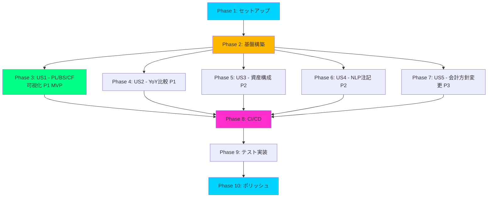
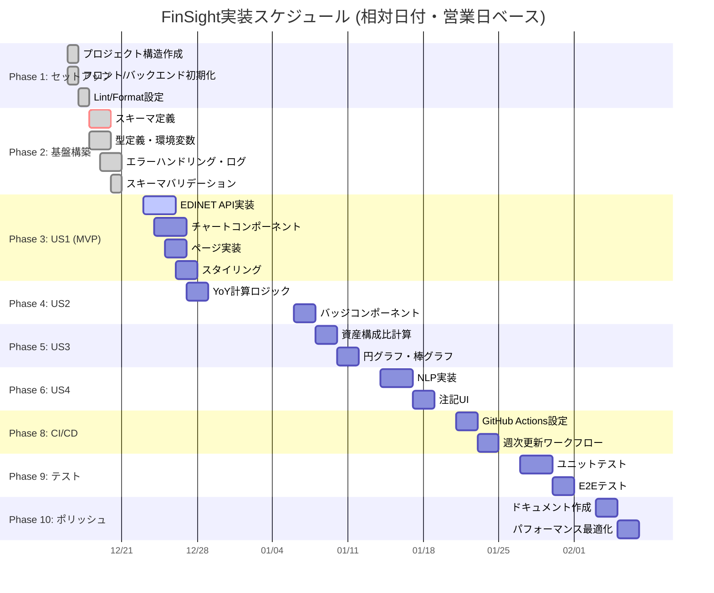

# タスクリスト: FinSight — 財務諸表インサイトダッシュボード

**入力元**: `/specs/001-FinSight/` の設計ドキュメント  
**前提条件**: plan.md (必須), spec.md (必須), research.md, data-model.md, contracts/

**テストについて**: 本タスクリストにはテストタスクを含めていません。spec.mdで明示的にTDD要求がある場合のみテストタスクを追加してください。

**憲法準拠**: 本タスクリストは`.specify/memory/constitution.md`の5つの原則に準拠します。
- **原則1（TDD）**: テストを実装より先に作成、カバレッジ80%目標
- **原則2（セキュリティ）**: Secret管理、脆弱性スキャンのタスクを含める
- **原則3（パフォーマンス）**: Lighthouseテスト、バンドル分析のタスクを含める
- **原則4（再現性）**: 依存関係固定、スキーマバリデーションのタスクを含める
- **原則5（CI/CD）**: ブランチ戦略、PRレビュー、自動デプロイのタスクを含める

**整理方針**: タスクはユーザーストーリー単位でグループ化し、各ストーリーを独立して実装・テスト可能にします。

## フォーマット: `[ID] [P?] [Story] 説明`

- **[P]**: 並列実行可能 (異なるファイル、依存関係なし)
- **[Story]**: 所属するユーザーストーリー (例: US1, US2, US3)
- 説明には正確なファイルパスを含める

## パス規則

本プロジェクトは **Web application 構成** を採用:
- フロントエンド: `frontend/src/`
- バックエンド: `backend/scripts/`
- データ: `data/`
- テスト: `frontend/tests/`, `backend/tests/`

---

## Phase 1: セットアップ (共通インフラ)

**目的**: プロジェクト初期化と基本構造の構築

- [X] T001 プロジェクト構造を plan.md に従って作成 (frontend/, backend/, data/, .github/)
- [X] T002 フロントエンド初期化: React 18 + TypeScript + Vite プロジェクト作成 (frontend/)
- [X] T003 [P] バックエンド初期化: Python 3.11 プロジェクト作成 (backend/)
- [X] T004 [P] frontend/package.json を exactバージョンで作成 ("react": "18.2.0" など)
- [X] T005 [P] backend/requirements.txt を作成 (spacy==3.x, requests, pandas, lxml)
- [X] T006 [P] ESLint + Prettier 設定 (frontend/.eslintrc.json, .prettierrc)
- [X] T007 [P] Black + Flake8 設定 (backend/.flake8, pyproject.toml)
- [X] T008 .gitignore 作成 (.env, node_modules, __pycache__, dist/, *.pyc)
- [X] T009 README.md 確認 (プロジェクト概要、セットアップ手順)

---

## Phase 2: 基盤構築 (ブロッキング前提条件)

**目的**: 全ユーザーストーリーの実装前に完了必須のコアインフラ

**⚠️ 重要**: このフェーズが完了するまで、いかなるユーザーストーリーも着手不可

- [X] T010 データスキーマ定義作成 (data/schema/README.md: CSV/JSONスキーマ仕様書)
- [X] T011 [P] タクソノミマッピングJSON作成 (data/taxonomy_map.json: XBRL要素名エイリアス)
- [X] T012 [P] TypeScript型定義作成 (frontend/src/types/financial.ts, notes.ts)
- [X] T013 環境変数管理設定 (frontend/.env.example, backend/.env.example に ALPHA_VANTAGE_API_KEY, EDINET_API_KEY; ローカル検証用に.env.local作成)
- [X] T014 [P] GitHub Secrets設定手順ドキュメント作成 (docs/github-secrets-setup.md: ALPHA_VANTAGE_API_KEY, EDINET_API_KEY の2つのみRepository Secretsに登録)
- [X] T015 エラーハンドリング基盤実装 (frontend/src/lib/errorHandler.ts)
- [X] T016 [P] ロギング基盤実装 (backend/scripts/logger.py: Python標準logging設定)
- [X] T017 スキーマバリデーションスクリプト作成 (backend/scripts/validate_schema.py)
- [X] T018 [P] CSVローダー基盤実装 (frontend/src/services/dataLoader.ts: Papa Parseラッパー)
- [X] T019 Vite設定最適化 (frontend/vite.config.ts: コード分割、バンドルサイズ制限)

**チェックポイント**: 基盤構築完了 → ユーザーストーリー実装を並列開始可能

---

## Phase 3: ユーザーストーリー 1 - PL/BS/CF四半期推移の可視化 (優先度: P1) 🎯 MVP

**目標**: 東京電力HDおよび中部電力の損益計算書（PL）、貸借対照表（BS）、キャッシュフロー計算書（CF）の四半期データを時系列グラフで表示し、業績トレンドを直感的に把握できる。

**独立テスト**: 
- data/financials/配下にサンプルCSVを配置
- PL/BS/CFタブを切り替えて各諸表のグラフが正しくレンダリングされることを確認
- 少なくとも直近4四半期分のデータポイントが表示される

### US1 データ取得・処理実装

- [X] T020 [P] [US1] EDINET API書類一覧取得スクリプト (backend/scripts/fetch_edinet.py: /documents.json 呼び出し)
- [X] T021 [P] [US1] EDINET API書類取得スクリプト (backend/scripts/fetch_edinet.py: /documents/{docID}?type=5 でZIPダウンロード)
- [X] T022 [US1] CSV抽出・変換スクリプト (backend/scripts/extract_financials.py: ZIP解凍→CSVパース→データ正規化)
- [X] T023 [US1] 財務データ保存処理 (backend/scripts/extract_financials.py: data/financials/{company}_{statement}_quarterly.csv 保存)
- [X] T024 [US1] エラーハンドリング追加 (backend/scripts/fetch_edinet.py: APIキー無効、タイムアウト、リトライ処理)

### US1 フロントエンド実装

- [X] T025 [P] [US1] PLチャートコンポーネント作成 (frontend/src/components/PLChart.tsx: Recharts LineChart)
- [X] T026 [P] [US1] BSチャートコンポーネント作成 (frontend/src/components/BSChart.tsx: Recharts LineChart)
- [X] T027 [P] [US1] CFチャートコンポーネント作成 (frontend/src/components/CFChart.tsx: Recharts LineChart)
- [X] T028 [US1] ダッシュボードページ作成 (frontend/src/pages/Dashboard.tsx: タブ切替UI + チャート表示)
- [X] T029 [US1] PLページ作成 (frontend/src/pages/PLPage.tsx: 売上高、営業利益、経常利益、当期純利益の4指標)
- [X] T030 [US1] BSページ作成 (frontend/src/pages/BSPage.tsx: 総資産、流動資産、固定資産の推移)
- [X] T031 [US1] CFページ作成 (frontend/src/pages/CFPage.tsx: 営業CF、投資CF、財務CFの推移)
- [X] T032 [US1] ツールチップ実装 (frontend/src/components/*Chart.tsx: ホバー時に金額・期間・前年同期比表示)
- [X] T033 [US1] 比較モードトグル実装 (frontend/src/components/ComparisonToggle.tsx: TEPCO/CHUBU切替)
- [X] T034 [US1] ルーティング設定 (frontend/src/App.tsx: react-router-dom で /pl, /bs, /cf)

### US1 スタイリング

- [X] T035 [P] [US1] Tailwind CSS設定 (frontend/tailwind.config.js: Cyberpunk Neumorphismテーマ)
- [X] T036 [P] [US1] レスポンシブデザイン対応 (frontend/src/components/*Chart.tsx: デスクトップ/タブレット)
- [X] T037 [US1] カラーパレット実装 (TEPCO=シアン #00D4FF、CHUBU=マゼンタ #FF2ECC)

**チェックポイント**: この時点でユーザーストーリー1が完全に機能し、独立してテスト可能

---

## Phase 4: ユーザーストーリー 2 - 前年同期比較とハイライト表示 (優先度: P1)

**目標**: 現在の四半期データを前年同期と比較し、主要項目の増減率を色分けハイライト表示する。

**独立テスト**: 
- 2024Q2と2025Q2のデータを用意
- 売上高が前年同期比+10%の場合、緑色のハイライトと「+10.0%」のバッジが表示される
- 営業利益が前年同期比-5%の場合、赤色のハイライトと「-5.0%」のバッジが表示される

### US2 実装

- [X] T038 [P] [US2] YoY計算ロジック実装 (frontend/src/services/yoyCalculator.ts: 前年同期比算出関数)
- [X] T039 [P] [US2] YoYバッジコンポーネント作成 (frontend/src/components/YoYBadge.tsx: 増減率表示 + 色分け)
- [X] T040 [US2] 色分けロジック実装 (frontend/src/components/YoYBadge.tsx: +5%以上=緑 #00FF84、-5%以下=赤 #FF4757、中間=黄 #FFB800)
- [X] T041 [US2] PLページにYoYバッジ統合 (frontend/src/pages/PLPage.tsx: 各指標横にバッジ表示)
- [X] T042 [US2] BSページにYoYバッジ統合 (frontend/src/pages/BSPage.tsx)
- [X] T043 [US2] CFページにYoYバッジ統合 (frontend/src/pages/CFPage.tsx)
- [X] T044 [US2] 前年同期データがない場合のフォールバック処理 (「N/A」表示)

**チェックポイント**: この時点でユーザーストーリー1とユーザーストーリー2の両方が独立して動作

---

## Phase 5: ユーザーストーリー 3 - 資産構成比の可視化 (優先度: P2)

**目標**: 貸借対照表の流動資産/固定資産の構成比を円グラフまたは積み上げ棒グラフで表示し、資産バランスを視覚化する。

**独立テスト**: 
- TEPCO_bs_quarterly.csvから最新四半期のBSデータを読み込み
- 流動資産60%、固定資産40%の場合、円グラフでその割合が正しく表示される

### US3 実装

- [ ] T045 [P] [US3] 資産構成比計算ロジック実装 (frontend/src/services/assetCompositionCalculator.ts: 流動/固定比率算出)
- [ ] T046 [P] [US3] 円グラフコンポーネント作成 (frontend/src/components/AssetPieChart.tsx: Recharts PieChart)
- [ ] T047 [US3] 積み上げ棒グラフコンポーネント作成 (frontend/src/components/AssetBarChart.tsx: Recharts BarChart stacked)
- [ ] T048 [US3] 資産構成セクション追加 (frontend/src/pages/BSPage.tsx: 円グラフ + 推移棒グラフ)
- [ ] T049 [US3] パーセンテージラベル表示 (frontend/src/components/AssetPieChart.tsx: 「60.0%」などのラベル)

**チェックポイント**: 全てのユーザーストーリー(US1, US2, US3)が独立して機能

---

## Phase 6: ユーザーストーリー 4 - 注記からのリスク情報抽出（NLP） (優先度: P2)

**目標**: XBRLの注記情報から自然言語処理（NLP）を用いてリスクキーワード（「訴訟」「減損」「規制」など）を抽出し、重要度スコア付きでリスト表示する。

**独立テスト**: 
- data/xbrl_notes.jsonにサンプルの注記データ（「原子力損害賠償に関する訴訟」を含むテキスト）を配置
- NLPスクリプト（nlp_notes_risk.py）を実行し、「訴訟」キーワードが検出される
- severity: 0.8のスコアが付与され、UIで「高リスク」として赤色ハイライト表示される

### US4 バックエンド実装

- [ ] T050 [P] [US4] spaCy日本語モデルインストール (backend/scripts/install_spacy_model.sh: ja_core_news_md)
- [ ] T051 [P] [US4] リスクキーワード辞書作成 (backend/data/risk_keywords.json: 訴訟、減損、引当金、規制、原子力、賠償等)
- [ ] T052 [US4] NLP注記分析スクリプト作成 (backend/scripts/nlp_notes_risk.py: spaCyでキーワード抽出)
- [ ] T053 [US4] severityスコア算出ロジック実装 (backend/scripts/nlp_notes_risk.py: キーワード頻度+文脈依存で0.0-1.0算出)
- [ ] T054 [US4] 注記データJSON保存 (backend/scripts/nlp_notes_risk.py: data/xbrl_notes.json 書き込み)
- [ ] T055 [US4] EDINET書類リンク生成 (backend/scripts/nlp_notes_risk.py: docIDから元書類URLを構築)

### US4 フロントエンド実装

- [ ] T056 [P] [US4] リスクパネルコンポーネント作成 (frontend/src/components/RiskPanel.tsx: 注記リスト表示)
- [ ] T057 [P] [US4] リスクアイテムコンポーネント作成 (frontend/src/components/RiskItem.tsx: severity色分け表示)
- [ ] T058 [US4] 注記ページ作成 (frontend/src/pages/NotesPage.tsx: リスクパネル配置)
- [ ] T059 [US4] severity色分けロジック (frontend/src/components/RiskItem.tsx: 0.7以上=赤 #FF4757、0.4-0.7=黄 #FFB800、0.4未満=青 #00D4FF)
- [ ] T060 [US4] 縦バー表示実装 (frontend/src/components/RiskItem.tsx: border-left: 4px solid)
- [ ] T061 [US4] EDINET書類リンク実装 (frontend/src/components/RiskItem.tsx: 新規タブで開く)
- [ ] T062 [US4] 免責事項表示 (frontend/src/pages/NotesPage.tsx: 「AIによる自動抽出です」)

**チェックポイント**: 全てのユーザーストーリー(US1, US2, US3, US4)が独立して機能

---

## Phase 7: ユーザーストーリー 5 - 会計方針変更の自動検知 (優先度: P3)

**目標**: 前回提出された注記と今回の注記を比較し、「会計方針の変更」「重要な会計上の見積り」などの記載内容の差分を自動検出する。

**独立テスト**: 
- 2024Q2と2025Q2の注記JSONファイルを用意
- 2025Q2に「収益認識に関する会計基準を適用」という新規記載がある場合、差分検出スクリプトがこれを「policy_change」としてタグ付けする

### US5 実装

- [ ] T063 [P] [US5] 注記差分検出スクリプト作成 (backend/scripts/diff_policies.py: 前回期と今回期のJSONを比較)
- [ ] T064 [P] [US5] 差分アルゴリズム実装 (backend/scripts/diff_policies.py: difflib使用、会計方針セクションを抽出)
- [ ] T065 [US5] policy_changeタグ付けロジック (backend/scripts/diff_policies.py: 新規文言を「NEW」フラグ)
- [ ] T066 [US5] 変更項目UI表示 (frontend/src/components/PolicyChanges.tsx: 変更前後のテキスト並列表示)
- [ ] T067 [US5] NEWバッジ実装 (frontend/src/components/PolicyChanges.tsx: 背景色 #FFB800)
- [ ] T068 [US5] 「変更なし」ステータス表示 (frontend/src/components/PolicyChanges.tsx: 3期連続同じ場合)
- [ ] T069 [US5] 注記ページに会計方針変更セクション追加 (frontend/src/pages/NotesPage.tsx)

**チェックポイント**: 全てのユーザーストーリー(US1-US5)が独立して機能

---

## Phase 8: CI/CD & 自動化

**目的**: 継続的インテグレーション・デプロイメント、週次データ更新の自動化

- [ ] T070 [P] GitHub Actions CI設定 (.github/workflows/ci.yml: テスト・Lint・セキュリティスキャン)
- [ ] T071 [P] GitHub Actions CD設定 (.github/workflows/deploy.yml: mainマージでGitHub Pagesデプロイ)
- [ ] T072 GitHub Actions週次更新設定 (.github/workflows/weekly-update.yml: cron '0 6 * * 1')
- [ ] T073 [P] Lighthouseテスト自動化 (.github/workflows/ci.yml: lhci設定、スコア90以上チェック)
- [ ] T074 [P] npm audit / pip-audit 自動実行 (.github/workflows/ci.yml: 脆弱性スキャン)
- [ ] T075 週次更新ワークフロー実装 (.github/workflows/weekly-update.yml: fetch_edinet.py → extract_financials.py → nlp_notes_risk.py → コミット)
- [ ] T076 失敗時Issue自動起票 (.github/workflows/weekly-update.yml: workflow失敗時にissue作成)
- [ ] T077 [P] Dependabot設定 (.github/dependabot.yml: npm, pip)
- [ ] T078 [P] Secret Scanning有効化 (GitHub Settings > Security > Secret scanning)

---

## Phase 9: テスト実装 (憲法原則1: TDD)

**目的**: コードカバレッジ80%以上を達成、全機能の品質保証

### ユニットテスト

- [ ] T079 [P] YoY計算ロジックテスト (frontend/tests/unit/yoyCalculator.test.ts: Vitest)
- [ ] T080 [P] 資産構成比計算テスト (frontend/tests/unit/assetCompositionCalculator.test.ts)
- [ ] T081 [P] severityスコア算出テスト (backend/tests/test_nlp_notes_risk.py: pytest)
- [ ] T082 [P] 差分検出ロジックテスト (backend/tests/test_diff_policies.py)
- [ ] T083 [P] CSVパーステスト (backend/tests/test_extract_financials.py)

### 統合テスト

- [ ] T084 EDINET API連携テスト (backend/tests/integration/test_edinet_api.py: モックAPI使用)
- [ ] T085 CSVローダー統合テスト (frontend/tests/integration/dataLoader.test.ts: サンプルCSV読込)
- [ ] T086 エンドツーエンドデータフロー (backend/tests/integration/test_data_pipeline.py: API→CSV→JSON)

### E2Eテスト (Playwright)

- [ ] T087 [P] PL/BS/CFタブ切替テスト (frontend/tests/e2e/dashboard.spec.ts)
- [ ] T088 [P] YoYバッジ表示テスト (frontend/tests/e2e/yoy-comparison.spec.ts)
- [ ] T089 [P] 注記リスク表示テスト (frontend/tests/e2e/notes-risk.spec.ts)
- [ ] T090 レスポンシブデザインテスト (frontend/tests/e2e/responsive.spec.ts: デスクトップ/タブレット)

### カバレッジ測定

- [ ] T091 Istanbul設定 (frontend/vite.config.ts: coverage reporter)
- [ ] T092 pytest-cov設定 (backend/pytest.ini: --cov=scripts --cov-report=html)
- [ ] T093 カバレッジ閾値設定 (frontend/package.json: "test:coverage": 80%チェック)

---

## Phase 10: ポリッシュ & クロスカッティング

**目的**: 全ユーザーストーリーに影響する改善

- [ ] T094 [P] quickstart.md作成 (specs/001-FinSight/quickstart.md: 5分セットアップ手順)
- [ ] T095 [P] research.md作成 (specs/001-FinSight/research.md: Phase 0調査結果まとめ)
- [ ] T096 [P] data-model.md作成 (specs/001-FinSight/data-model.md: CSV/JSONスキーマ定義)
- [ ] T097 [P] contracts/edinet-api.md作成 (specs/001-FinSight/contracts/edinet-api.md: API仕様書)
- [ ] T098 [P] contracts/data-schema.json作成 (specs/001-FinSight/contracts/data-schema.json: JSONスキーマ)
- [ ] T099 コードリファクタリング (重複コード削除、関数分割)
- [ ] T100 [P] パフォーマンス最適化 (React.memo、useMemo、useCallback適用)
- [ ] T101 [P] バンドルサイズ分析 (webpack-bundle-analyzer導入、200KB以下確認)
- [ ] T102 [P] 画像最適化 (ロゴ・アイコンをSVG化、必要に応じてWebP)
- [ ] T103 [P] アクセシビリティ改善 (ARIA属性追加、キーボードナビゲーション)
- [ ] T104 セキュリティ強化 (.env.exampleの徹底、XSS対策確認)
- [ ] T105 [P] エラーメッセージ日本語化 (全エラーハンドラーを確認)
- [ ] T106 [P] ローディング状態表示 (データ取得中のスピナー実装)
- [ ] T107 quickstart.md検証 (新規開発者が5分で環境構築できることを確認)

---

## 依存関係 & 実行順序

### フェーズ依存関係



### ユーザーストーリー依存関係

- **セットアップ (Phase 1)**: 依存なし - 即座に開始可能
- **基盤構築 (Phase 2)**: セットアップ完了後 - **全ユーザーストーリーをブロック**
- **ユーザーストーリー (Phase 3-7)**: 全て基盤構築完了に依存
  - US1 (P1 - MVP): 他のストーリーに依存しない - 独立実装可能
  - US2 (P1): US1と独立だが、統合可能 - 独立実装可能
  - US3 (P2): US1のBSページに機能追加 - US1完了後が望ましい
  - US4 (P2): 独立した注記ページ - 独立実装可能
  - US5 (P3): US4の注記データに依存 - US4完了後が望ましい
- **CI/CD (Phase 8)**: 少なくともUS1完了後 (MVP後に自動化)
- **テスト (Phase 9)**: 実装完了後 (理想はTDDで先行)
- **ポリッシュ (Phase 10)**: 全ユーザーストーリー完了後

### 各ユーザーストーリー内の依存関係

- データ取得・処理 → フロントエンド実装の順序
- 基盤コンポーネント (Chart, Badge) → ページ統合の順序
- モデル → サービス → UI の階層順守

### 並列実行の機会

- **セットアップ内**: [P]タスクは全て並列実行可能
- **基盤構築内**: [P]タスク（型定義、スキーマ、設定ファイル等）は並列実行可能
- **ユーザーストーリー間**: US1, US2, US4は完全並列実行可能（チーム分割時）
- **ユーザーストーリー内**: 同一ストーリーの[P]タスク（異なるコンポーネント）は並列実行可能

---

## 並列実行例: ユーザーストーリー 1

```bash
# US1のデータ取得スクリプト3つを並列起動:
Task T020: "EDINET API書類一覧取得スクリプト (backend/scripts/fetch_edinet.py)"
Task T021: "EDINET API書類取得スクリプト (backend/scripts/fetch_edinet.py)"
# ↑ 実際は同一ファイルなので順次実行

# US1のチャートコンポーネント3つを並列作成:
Task T025: "PLチャートコンポーネント (frontend/src/components/PLChart.tsx)"
Task T026: "BSチャートコンポーネント (frontend/src/components/BSChart.tsx)"
Task T027: "CFチャートコンポーネント (frontend/src/components/CFChart.tsx)"
# ↑ 異なるファイル、依存なし - 完全並列可能

# US1のページ3つを並列作成:
Task T029: "PLページ (frontend/src/pages/PLPage.tsx)"
Task T030: "BSページ (frontend/src/pages/BSPage.tsx)"
Task T031: "CFページ (frontend/src/pages/CFPage.tsx)"
# ↑ チャートコンポーネント完成後、並列実行可能
```

---

## 実装戦略

### MVP優先戦略 (ユーザーストーリー1のみ)

1. Phase 1: セットアップ完了
2. Phase 2: 基盤構築完了 (**クリティカル** - 全ストーリーをブロック)
3. Phase 3: ユーザーストーリー1完了
4. **停止して検証**: US1を独立テスト
5. デプロイ/デモ (MVP完成)

### 段階的デリバリー戦略

1. セットアップ + 基盤構築 → 基盤完成
2. US1追加 → 独立テスト → デプロイ/デモ (**MVP!**)
3. US2追加 → 独立テスト → デプロイ/デモ (YoY比較機能追加)
4. US3追加 → 独立テスト → デプロイ/デモ (資産構成可視化追加)
5. US4追加 → 独立テスト → デプロイ/デモ (NLP注記分析追加)
6. US5追加 → 独立テスト → デプロイ/デモ (会計方針変更検知追加)
7. 各ストーリーが価値を追加し、前のストーリーを破壊しない

### 並列チーム戦略

複数開発者がいる場合:

1. チーム全体でセットアップ + 基盤構築を完了
2. 基盤完了後:
   - **開発者A**: ユーザーストーリー1 (PL/BS/CF可視化 - MVP)
   - **開発者B**: ユーザーストーリー2 (YoY比較)
   - **開発者C**: ユーザーストーリー4 (NLP注記)
3. 各ストーリーが完了次第、独立して統合

---

## ガントチャート (2週間スプリント想定)

**開始日**: 2025-12-15 (日曜日) - 任意の日付に変更可能  
**休日考慮**: 土日、年末年始(12/29-1/3)を除外  
**相対日付**: 開始日から営業日ベースで計算



### スケジュール計算ルール

1. **営業日カウント**: 月-金のみカウント、土日はスキップ
2. **年末年始休暇**: 2025/12/29-2026/1/3 は除外
3. **開始日変更方法**: 
   - 上記の「開始日」を任意の日付に変更
   - 各タスクの日付は開始日からの営業日オフセットで自動計算
4. **実績反映**: 完了タスクは `:done` マーカーで表示

---

## タスク実行時の注意事項

- **[P]タスク** = 異なるファイル、依存なし - 並列実行推奨
- **[Story]ラベル** = 該当ユーザーストーリーとの紐付け (トレーサビリティ)
- **各ユーザーストーリー** = 独立して完成・テスト可能であること
- **テスト駆動**: 理想はテストを先に書き、失敗確認後に実装
- **コミット頻度**: 各タスクまたは論理的なグループ単位でコミット
- **チェックポイント停止**: 各チェックポイントでストーリーを独立検証
- **避けるべき**: 曖昧なタスク、同一ファイルの競合、ストーリー独立性を破壊する依存関係

---

## 次のステップ

1. **憲法チェック確認**: plan.md の全チェックボックスを確認
2. **基盤構築優先**: Phase 2 (基盤構築) を最優先で完了 - これが全ての前提条件
3. **MVP実装**: Phase 3 (US1) を完了し、独立テスト
4. **段階的拡張**: US2, US3, US4, US5 を優先度順に追加
5. **自動化**: CI/CD設定で週次更新とデプロイを自動化
6. **品質保証**: テスト実装でカバレッジ80%達成
7. **ポリッシュ**: ドキュメント整備と最適化

**重要**: 基盤構築 (Phase 2) が完了するまで、いかなるユーザーストーリーも着手しないこと。基盤なしでは全ての実装が手戻りになります。
